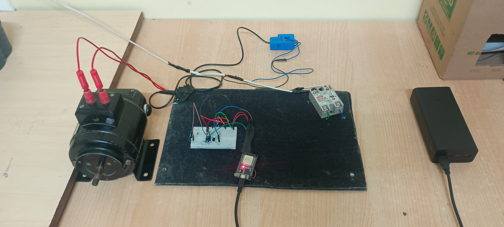
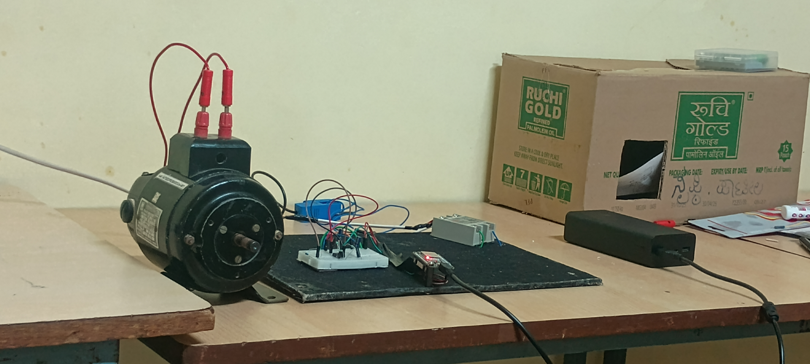

# Hardware Prototype Gallery

This directory contains photographs of the physical Motor Edge Guard test bench and prototype assembly used during evaluation.

---

## Benchtop Hardware Setup

### 1. Plan View (Top-Down Assembly)
Top-down view showing the single-phase motor load, split-core SCT-013 current transformer, breadboard conditioning stage (LM358), ESP32 processing node, and the industrial solid-state relay (SSR).

### 2. Perspective View (Bench Testbed)
Front perspective view showing the motor shaft assembly and wired isolation loop under test conditions.

---

## Component Layout Reference

* **AC Load:** 230V Single-phase universal motor on isolated mounting feet.
* **Current Sensing:** Blue SCT-013 non-invasive current transformer clamped over the phase conductor.
* **Analog Stage:** Solderless breadboard housing the LM358 op-amp conditioning circuit (burden resistor + 1.65V DC offset divider).
* **Controller:** 30-Pin ESP32 Dev Module powered via USB.
* **Power Actuation:** Zero-cross Solid-State Relay (SSR) mounted on the baseplate in series with the motor mains line.
  
